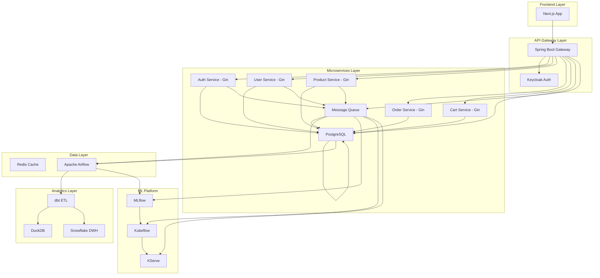
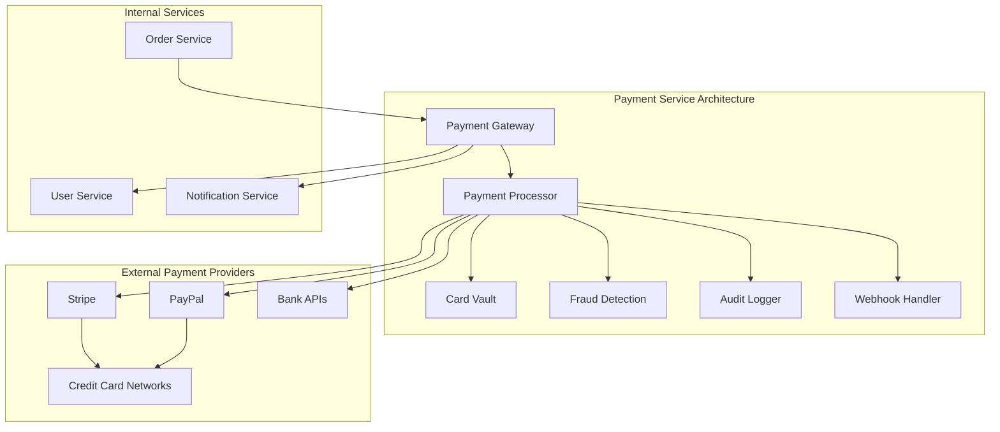
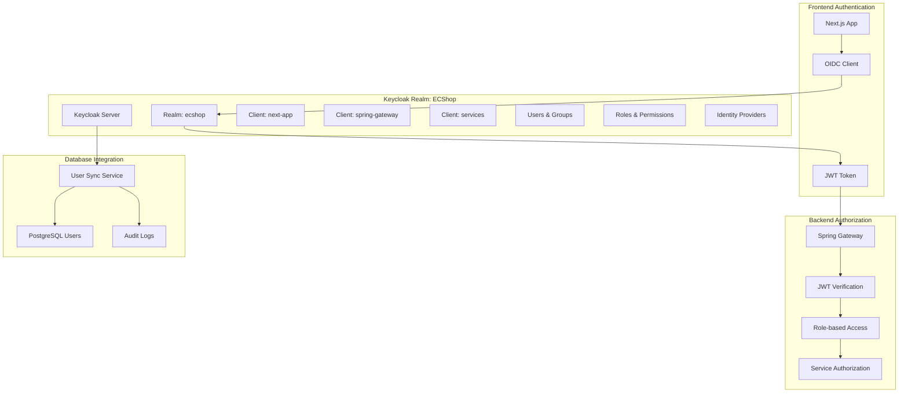
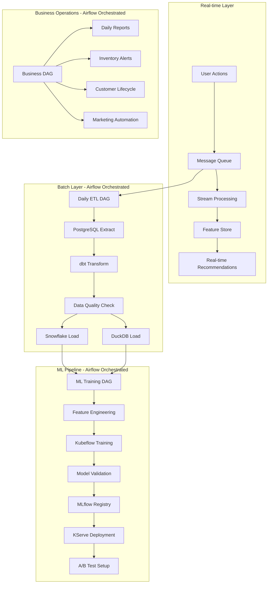
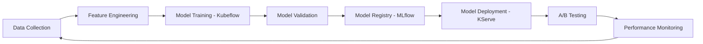

# ECShop - Enterprise E-commerce Platform

## 概要

ECShopは、最新のクラウドネイティブ技術スタックを活用したエンタープライズグレードのECプラットフォームです。マイクロサービスアーキテクチャ、データドリブンなレコメンデーション、MLOpsによる継続的な機械学習改善を特徴としています。

## アーキテクチャ概要

### Technology Stack

```
Infrastructure Layer:
├── AWS EKS (Kubernetes)
├── Terraform (IaC)
└── PostgreSQL on RDS

Application Layer:
├── Frontend: Next.js (TypeScript)
├── API Gateway: Spring Boot
├── Microservices: Gin (Go)
└── Authentication: Keycloak

Data Platform:
├── Operational DB: PostgreSQL
├── Message Queue: RabbitMQ/Apache Kafka
├── Workflow Orchestration: Apache Airflow
├── ETL: dbt
├── Analytics DB: DuckDB
└── Data Warehouse: Snowflake

MLOps Platform:
├── Experiment Tracking: MLflow
├── Pipeline: Kubeflow
├── Model Serving: KServe
├── Orchestration: Apache Airflow
└── Feature Store: Built-in
```

## システム構成

### Microservices Architecture



## データモデル設計

### Core Entities

#### ユーザー管理
- **User**: Keycloak連携による認証基盤
- **Role/UserRole**: RBAC による権限管理
- **UserActionLog**: 全ユーザー行動のログ収集

#### 商品管理
- **Product**: 商品マスタ
- **Category/ProductCategory**: 多階層カテゴリ
- **TopPageDisplay**: パーソナライゼーション対応

#### 取引管理
- **Order/OrderItem**: 注文管理
- **Payment**: 決済管理（独立サービス）
- **CartItem**: カート機能
- **Return/ReturnItem**: 返品処理
- **ViewHistory**: 閲覧履歴（ML学習用）

### ML特化データ設計

```sql
-- レコメンデーション用特徴量
ViewHistory: ユーザー閲覧パターン（Random Forest）
CartItem: カート行動分析（K-means クラスタリング）
Order: 購入履歴予測（Linear Regression）
UserActionLog: 行動ログ分析（PCA次元削減）
```

## マイクロサービス設計

### Service Boundaries

#### 🔐 **1. Auth Service**
```go
// Responsibilities:
- JWT トークン発行・検証
- Keycloak 連携・プロキシ
- セッション管理
- 認証状態管理
- パスワードリセット
- MFA 管理

// APIs:
POST   /api/v1/auth/login
POST   /api/v1/auth/logout  
POST   /api/v1/auth/refresh
GET    /api/v1/auth/verify
POST   /api/v1/auth/password-reset
POST   /api/v1/auth/mfa/enable
POST   /api/v1/auth/mfa/verify

// Internal APIs (for other services):
GET    /api/internal/auth/validate-token
GET    /api/internal/auth/user-permissions/{userId}
```

#### 👤 **2. User Service**
```go
// Responsibilities:
- ユーザープロファイル管理
- ユーザー設定・嗜好
- ユーザー関連ビジネスロジック
- Keycloak ユーザー同期
- ユーザー分析データ

// APIs:
GET    /api/v1/users/{id}
PUT    /api/v1/users/{id}
GET    /api/v1/users/{id}/profile
PUT    /api/v1/users/{id}/profile
GET    /api/v1/users/{id}/preferences
PUT    /api/v1/users/{id}/preferences
GET    /api/v1/users/{id}/analytics
POST   /api/v1/users/{id}/deactivate

// Admin APIs:
GET    /api/v1/admin/users
POST   /api/v1/admin/users/{id}/roles
DELETE /api/v1/admin/users/{id}/roles/{roleId}
```

#### 🛍️ **3. Product Service**
```go
// Responsibilities:
- ユーザー認証・認可 (Keycloak連携)
- プロファイル管理
- ロール・権限管理

// APIs:
GET    /api/v1/users/{id}
PUT    /api/v1/users/{id}
POST   /api/v1/users/{id}/roles
DELETE /api/v1/users/{id}/roles/{roleId}
GET    /api/v1/users/{id}/profile
PUT    /api/v1/users/{id}/profile
```

#### 2. Product Service
```go
// Responsibilities:
- 商品マスタ管理
- カテゴリ管理
- 在庫管理

// APIs:
GET    /api/v1/products
GET    /api/v1/products/{id}
POST   /api/v1/products
PUT    /api/v1/products/{id}
GET    /api/v1/categories
```

#### 3. Order Service
```go
// Responsibilities:
- 注文処理
- 決済連携
- 注文履歴管理

// APIs:
POST   /api/v1/orders
GET    /api/v1/orders/{id}
GET    /api/v1/users/{userId}/orders
PUT    /api/v1/orders/{id}/status
```

#### 4. Cart Service
```go
// Responsibilities:
- カート管理
- セッション管理
- 一時保存

// APIs:
GET    /api/v1/users/{userId}/cart
POST   /api/v1/users/{userId}/cart/items
PUT    /api/v1/users/{userId}/cart/items/{itemId}
DELETE /api/v1/users/{userId}/cart/items/{itemId}
```

#### 6. Workflow Orchestration Service
```go
// Responsibilities:
- データパイプライン管理
- MLワークフロー自動化
- バッチ処理スケジューリング
- 業務プロセス自動化

// Integration APIs:
POST   /api/v1/workflows/trigger/{workflow_id}
GET    /api/v1/workflows/status/{execution_id}
GET    /api/v1/workflows/logs/{execution_id}
POST   /api/v1/workflows/retry/{execution_id}
```

#### 5. Recommendation Service
```go
// Responsibilities:
- ML モデル予測
- レコメンデーション生成
- A/Bテスト管理

// APIs:
GET    /api/v1/users/{userId}/recommendations
POST   /api/v1/recommendations/feedback
GET    /api/v1/products/{productId}/similar
```

#### ⚙️ **8. Workflow Orchestration Service**
```go
// Responsibilities:
- データパイプライン管理
- MLワークフロー自動化
- バッチ処理スケジューリング
- 業務プロセス自動化

// Integration APIs:
POST   /api/v1/workflows/trigger/{workflow_id}
GET    /api/v1/workflows/status/{execution_id}
GET    /api/v1/workflows/logs/{execution_id}
POST   /api/v1/workflows/retry/{execution_id}
```

## Payment Service 詳細設計

### アーキテクチャ



### データモデル設計

```prisma
// Payment Service Database Schema

model Payment {
  id                String        @id @default(uuid())
  orderId           String        // Order Service との関連
  userId            String        // User Service との関連
  amount            Decimal       @db.Money
  currency          String        @default("JPY")
  status            PaymentStatus @default(PENDING)
  paymentMethod     PaymentMethod
  
  // Provider specific data (encrypted)
  providerTransactionId String?
  providerData          Json?       @db.JsonB
  
  // Security & Compliance
  ipAddress         String?
  userAgent         String?
  riskScore         Float?
  fraudCheckResult  Json?         @db.JsonB
  
  // Audit fields
  createdAt         DateTime      @default(now())
  updatedAt         DateTime      @updatedAt
  processedAt       DateTime?
  
  // Relations
  refunds           Refund[]
  disputes          Dispute[]
  webhookEvents     WebhookEvent[]
  
  @@index([orderId])
  @@index([userId])
  @@index([status])
  @@index([createdAt])
}

enum PaymentStatus {
  PENDING           // 処理待ち
  PROCESSING        // 処理中
  AUTHORIZED        // 認証済み（未キャプチャ）
  CAPTURED          // キャプチャ済み
  COMPLETED         // 完了
  FAILED            // 失敗
  CANCELLED         // キャンセル
  REFUNDED          // 返金済み
  PARTIALLY_REFUNDED // 部分返金
  DISPUTED          // 争議中
}

enum PaymentMethod {
  CREDIT_CARD
  DEBIT_CARD
  BANK_TRANSFER
  DIGITAL_WALLET    // PayPal, Apple Pay, Google Pay
  CRYPTOCURRENCY
  BNPL             // Buy Now Pay Later
}

model PaymentMethodStore {
  id              String    @id @default(uuid())
  userId          String
  type            PaymentMethod
  isDefault       Boolean   @default(false)
  
  // Encrypted card data (PCI DSS compliant)
  encryptedData   String    // カード番号、CVVは外部Vault
  last4Digits     String?   // 表示用
  expiryMonth     Int?
  expiryYear      Int?
  cardBrand       String?   // Visa, MasterCard, etc.
  
  // Bank account data
  bankName        String?
  accountType     String?
  
  // Metadata
  billingAddress  Json?     @db.JsonB
  metadata        Json?     @db.JsonB
  
  createdAt       DateTime  @default(now())
  updatedAt       DateTime  @updatedAt
  lastUsedAt      DateTime?
  
  @@index([userId])
  @@index([type])
}

model Refund {
  id              String      @id @default(uuid())
  paymentId       String
  amount          Decimal     @db.Money
  reason          RefundReason
  status          RefundStatus @default(PENDING)
  
  providerRefundId String?
  processedAt      DateTime?
  
  createdAt       DateTime    @default(now())
  updatedAt       DateTime    @updatedAt
  
  payment         Payment     @relation(fields: [paymentId], references: [id])
  
  @@index([paymentId])
}

enum RefundReason {
  CUSTOMER_REQUEST
  FRAUD_PREVENTION
  ORDER_CANCELLATION
  QUALITY_ISSUE
  SHIPPING_ISSUE
  DUPLICATE_PAYMENT
  CHARGEBACK
}

enum RefundStatus {
  PENDING
  PROCESSING
  COMPLETED
  FAILED
  REJECTED
}

model Dispute {
  id              String        @id @default(uuid())
  paymentId       String
  amount          Decimal       @db.Money
  reason          DisputeReason
  status          DisputeStatus @default(RECEIVED)
  evidenceRequired Boolean      @default(true)
  
  providerDisputeId String?
  dueDate          DateTime?
  resolvedAt       DateTime?
  
  createdAt       DateTime      @default(now())
  updatedAt       DateTime      @updatedAt
  
  payment         Payment       @relation(fields: [paymentId], references: [id])
  
  @@index([paymentId])
  @@index([status])
}

enum DisputeReason {
  FRAUD
  AUTHORIZATION
  PROCESSING_ERROR
  CUSTOMER_DISPUTE
  DUPLICATE_PROCESSING
  CREDIT_NOT_PROCESSED
  CANCELLED_SUBSCRIPTION
  PRODUCT_NOT_RECEIVED
  PRODUCT_UNACCEPTABLE
}

enum DisputeStatus {
  RECEIVED
  UNDER_REVIEW
  NEEDS_RESPONSE
  WAITING_EVIDENCE
  RESOLVED_WON
  RESOLVED_LOST
  CLOSED
}
```

### Service Implementation Examples

#### Auth Service Implementation
```go
// auth-service/internal/handlers/auth.go
package handlers

type AuthHandler struct {
    keycloakClient *keycloak.Client
    redisClient    *redis.Client
    userService    *clients.UserServiceClient
}

// ログイン処理
func (h *AuthHandler) Login(c *gin.Context) {
    var req LoginRequest
    if err := c.ShouldBindJSON(&req); err != nil {
        c.JSON(400, gin.H{"error": err.Error()})
        return
    }
    
    // Keycloak 認証
    token, err := h.keycloakClient.Login(req.Email, req.Password)
    if err != nil {
        c.JSON(401, gin.H{"error": "Invalid credentials"})
        return
    }
    
    // セッション作成
    sessionID := generateSessionID()
    session := Session{
        ID:          sessionID,
        UserID:      token.Subject,
        AccessToken: token.AccessToken,
        RefreshToken: token.RefreshToken,
        ExpiresAt:   time.Now().Add(time.Hour * 24),
    }
    
    err = h.redisClient.SetSession(sessionID, session)
    if err != nil {
        c.JSON(500, gin.H{"error": "Failed to create session"})
        return
    }
    
    // User Service に最終ログイン時刻更新を依頼
    go h.userService.UpdateLastLogin(token.Subject)
    
    c.JSON(200, LoginResponse{
        SessionID: sessionID,
        User:      token.Claims,
        ExpiresAt: session.ExpiresAt,
    })
}

// トークン検証 (他サービス向け)
func (h *AuthHandler) ValidateToken(c *gin.Context) {
    sessionID := c.GetHeader("X-Session-ID")
    
    session, err := h.redisClient.GetSession(sessionID)
    if err != nil {
        c.JSON(401, gin.H{"error": "Invalid session"})
        return
    }
    
    // Keycloak でトークン検証
    valid, claims, err := h.keycloakClient.ValidateToken(session.AccessToken)
    if err != nil || !valid {
        c.JSON(401, gin.H{"error": "Invalid token"})
        return
    }
    
    c.JSON(200, ValidationResponse{
        Valid:  true,
        UserID: claims.Subject,
        Roles:  claims.RealmRoles,
    })
}
```

#### Payment Service Implementation
```go
// payment-service/internal/handlers/payment.go
package handlers

type PaymentHandler struct {
    db              *sql.DB
    stripeClient    *stripe.Client
    paypalClient    *paypal.Client
    vaultClient     *vault.Client
    fraudDetector   *fraud.Detector
    eventPublisher  *events.Publisher
}

// 決済処理
func (h *PaymentHandler) ProcessPayment(c *gin.Context) {
    var req ProcessPaymentRequest
    if err := c.ShouldBindJSON(&req); err != nil {
        c.JSON(400, gin.H{"error": err.Error()})
        return
    }
    
    // 1. 不正検知
    riskScore, err := h.fraudDetector.AnalyzeTransaction(req)
    if err != nil {
        c.JSON(500, gin.H{"error": "Fraud analysis failed"})
        return
    }
    
    if riskScore > HIGH_RISK_THRESHOLD {
        c.JSON(400, gin.H{"error": "Transaction blocked due to high risk"})
        return
    }
    
    // 2. Payment record 作成
    payment := Payment{
        ID:           generateUUID(),
        OrderID:      req.OrderID,
        UserID:       req.UserID,
        Amount:       req.Amount,
        Currency:     req.Currency,
        Status:       PENDING,
        PaymentMethod: req.PaymentMethod,
        IPAddress:    c.ClientIP(),
        UserAgent:    c.GetHeader("User-Agent"),
        RiskScore:    riskScore,
        CreatedAt:    time.Now(),
    }
    
    err = h.db.CreatePayment(&payment)
    if err != nil {
        c.JSON(500, gin.H{"error": "Failed to create payment record"})
        return
    }
    
    // 3. 決済プロバイダー処理
    var providerResponse ProviderResponse
    switch req.PaymentMethod {
    case CREDIT_CARD:
        providerResponse, err = h.processStripePayment(payment, req)
    case DIGITAL_WALLET:
        providerResponse, err = h.processPayPalPayment(payment, req)
    default:
        err = errors.New("unsupported payment method")
    }
    
    if err != nil {
        payment.Status = FAILED
        h.db.UpdatePayment(&payment)
        c.JSON(400, gin.H{"error": err.Error()})
        return
    }
    
    // 4. 結果更新
    payment.Status = providerResponse.Status
    payment.ProviderTransactionID = providerResponse.TransactionID
    payment.ProviderData = providerResponse.Metadata
    payment.ProcessedAt = time.Now()
    
    err = h.db.UpdatePayment(&payment)
    if err != nil {
        // Critical error - notify operations team
        h.eventPublisher.PublishCriticalError("payment_update_failed", payment.ID)
    }
    
    // 5. イベント発行
    event := PaymentProcessedEvent{
        PaymentID: payment.ID,
        OrderID:   payment.OrderID,
        Status:    payment.Status,
        Amount:    payment.Amount,
    }
    h.eventPublisher.Publish("payment.processed", event)
    
    c.JSON(200, PaymentResponse{
        PaymentID: payment.ID,
        Status:    payment.Status,
        Message:   "Payment processed successfully",
    })
}

// 返金処理
func (h *PaymentHandler) ProcessRefund(c *gin.Context) {
    paymentID := c.Param("id")
    
    var req RefundRequest
    if err := c.ShouldBindJSON(&req); err != nil {
        c.JSON(400, gin.H{"error": err.Error()})
        return
    }
    
    // 1. Payment 取得
    payment, err := h.db.GetPayment(paymentID)
    if err != nil {
        c.JSON(404, gin.H{"error": "Payment not found"})
        return
    }
    
    // 2. 返金可能チェック
    if payment.Status != COMPLETED && payment.Status != CAPTURED {
        c.JSON(400, gin.H{"error": "Payment cannot be refunded"})
        return
    }
    
    // 3. 返金レコード作成
    refund := Refund{
        ID:        generateUUID(),
        PaymentID: paymentID,
        Amount:    req.Amount,
        Reason:    req.Reason,
        Status:    PENDING,
        CreatedAt: time.Now(),
    }
    
    err = h.db.CreateRefund(&refund)
    if err != nil {
        c.JSON(500, gin.H{"error": "Failed to create refund record"})
        return
    }
    
    // 4. プロバイダー返金処理
    providerRefundID, err := h.processProviderRefund(payment, req.Amount)
    if err != nil {
        refund.Status = FAILED
        h.db.UpdateRefund(&refund)
        c.JSON(400, gin.H{"error": err.Error()})
        return
    }
    
    // 5. 結果更新
    refund.Status = COMPLETED
    refund.ProviderRefundID = providerRefundID
    refund.ProcessedAt = time.Now()
    h.db.UpdateRefund(&refund)
    
    // 6. イベント発行
    event := RefundProcessedEvent{
        RefundID:  refund.ID,
        PaymentID: paymentID,
        OrderID:   payment.OrderID,
        Amount:    refund.Amount,
    }
    h.eventPublisher.Publish("payment.refunded", event)
    
    c.JSON(200, RefundResponse{
        RefundID: refund.ID,
        Status:   refund.Status,
        Message:  "Refund processed successfully",
    })
}
```

### Service Communication & Security

#### Inter-Service Authentication
```go
// shared/clients/auth_client.go
package clients

type AuthServiceClient struct {
    baseURL string
    client  *http.Client
}

type ValidationResponse struct {
    Valid  bool     `json:"valid"`
    UserID string   `json:"user_id"`
    Roles  []string `json:"roles"`
}

func (c *AuthServiceClient) ValidateRequest(req *http.Request) (*ValidationResponse, error) {
    sessionID := req.Header.Get("X-Session-ID")
    if sessionID == "" {
        return nil, errors.New("no session ID")
    }
    
    resp, err := c.client.Get(c.baseURL + "/api/internal/auth/validate-token?session_id=" + sessionID)
    if err != nil {
        return nil, err
    }
    defer resp.Body.Close()
    
    var validation ValidationResponse
    err = json.NewDecoder(resp.Body).Decode(&validation)
    return &validation, err
}
```

#### Order Service との連携
```go
// order-service/internal/handlers/order.go
package handlers

func (h *OrderHandler) CreateOrder(c *gin.Context) {
    // 1. 注文作成
    order := createOrder(req)
    err := h.db.CreateOrder(&order)
    if err != nil {
        c.JSON(500, gin.H{"error": "Failed to create order"})
        return
    }
    
    // 2. 在庫引当
    err = h.inventoryService.ReserveItems(order.Items)
    if err != nil {
        h.db.DeleteOrder(order.ID) // ロールバック
        c.JSON(400, gin.H{"error": "Insufficient inventory"})
        return
    }
    
    // 3. Payment Service に決済依頼
    paymentReq := PaymentRequest{
        OrderID:         order.ID,
        UserID:          order.UserID,
        Amount:          order.TotalAmount,
        Currency:        "JPY",
        PaymentMethod:   req.PaymentMethod,
        PaymentMethodID: req.PaymentMethodID,
    }
    
    paymentResp, err := h.paymentService.ProcessPayment(paymentReq)
    if err != nil {
        // 在庫解放
        h.inventoryService.ReleaseItems(order.Items)
        h.db.DeleteOrder(order.ID)
        c.JSON(400, gin.H{"error": "Payment failed"})
        return
    }
    
    // 4. 注文ステータス更新
    order.Status = ORDER_CONFIRMED
    order.PaymentID = paymentResp.PaymentID
    h.db.UpdateOrder(&order)
    
    c.JSON(200, OrderResponse{
        OrderID:   order.ID,
        PaymentID: paymentResp.PaymentID,
        Status:    order.Status,
    })
}
```

## Apache Airflow 統合設計

### Workflow Orchestration Architecture

```mermaid
graph TB
    subgraph "Airflow Core"
        A[Airflow Scheduler]
        B[Airflow Webserver]
        C[Airflow Workers]
        D[Airflow Metadata DB]
    end
    
    subgraph "Data Workflows"
        E[Daily ETL Pipeline]
        F[Real-time Processing]
        G[Data Quality Checks]
        H[Snowflake Sync]
    end
    
    subgraph "ML Workflows"
        I[Model Training Pipeline]
        J[Model Validation]
        K[Model Deployment]
        L[A/B Test Management]
    end
    
    subgraph "Business Workflows"
        M[Daily Reports]
        N[Marketing Automation]
        O[Inventory Management]
        P[Customer Lifecycle]
    end
    
    A --> E
    A --> F
    A --> G
    A --> H
    A --> I
    A --> J
    A --> K
    A --> L
    A --> M
    A --> N
    A --> O
    A --> P
    
    C --> D
    B --> D
```



### Core DAG Collections

#### 1. データパイプライン DAGs
```python
# dags/data_pipeline/daily_etl.py
from airflow import DAG
from airflow.providers.postgres.operators.postgres import PostgresOperator
from airflow.providers.snowflake.operators.snowflake import SnowflakeOperator
from airflow.providers.cncf.kubernetes.operators.kubernetes_pod import KubernetesPodOperator

dag = DAG(
    'daily_etl_pipeline',
    description='Daily ETL from PostgreSQL to Snowflake',
    schedule_interval='0 2 * * *',  # 毎日 AM 2:00
    start_date=datetime(2025, 1, 1),
    catchup=False,
    max_active_runs=1
)

# 1. データ品質チェック
data_quality_check = PostgresOperator(
    task_id='data_quality_check',
    sql="""
    SELECT 
        COUNT(*) as total_orders,
        COUNT(CASE WHEN total_amount <= 0 THEN 1 END) as invalid_orders
    FROM orders 
    WHERE DATE(ordered_at) = CURRENT_DATE - INTERVAL '1 day'
    """,
    dag=dag
)

# 2. dbt transformation
dbt_run = KubernetesPodOperator(
    task_id='dbt_transform',
    image='your-repo/dbt-snowflake:latest',
    cmds=['dbt', 'run', '--select', 'tag:daily'],
    namespace='ecshop-data',
    env_vars={
        'DBT_PROFILES_DIR': '/opt/dbt',
        'TARGET_DATE': '{{ ds }}'
    },
    dag=dag
)

# 3. Snowflake データ同期
sync_to_snowflake = SnowflakeOperator(
    task_id='sync_to_snowflake',
    sql="""
    CALL sync_daily_data_procedure('{{ ds }}');
    """,
    dag=dag
)

# 4. データ検証
validate_sync = SnowflakeOperator(
    task_id='validate_sync',
    sql="""
    SELECT 
        CASE 
            WHEN COUNT(*) > 0 THEN 'SUCCESS'
            ELSE 'FAILED'
        END as validation_result
    FROM ANALYTICS.DAILY_SALES
    WHERE sale_date = '{{ ds }}'
    """,
    dag=dag
)

# Dependencies
data_quality_check >> dbt_run >> sync_to_snowflake >> validate_sync
```

#### 2. MLOps パイプライン DAGs
```python
# dags/ml_pipeline/recommendation_training.py
from airflow.providers.cncf.kubernetes.operators.kubernetes_pod import KubernetesPodOperator
from airflow.providers.http.operators.http import SimpleHttpOperator

dag = DAG(
    'recommendation_model_training',
    description='Weekly recommendation model retraining',
    schedule_interval='0 1 * * 0',  # 毎週日曜 AM 1:00
    start_date=datetime(2025, 1, 1),
    catchup=False
)

# 1. 特徴量準備
prepare_features = KubernetesPodOperator(
    task_id='prepare_features',
    image='your-repo/ml-feature-engineering:latest',
    cmds=['python', 'prepare_features.py'],
    namespace='ecshop-ml',
    resources={
        'request_memory': '4Gi',
        'request_cpu': '2',
        'limit_memory': '8Gi',
        'limit_cpu': '4'
    },
    dag=dag
)

# 2. モデル訓練 (Kubeflow Pipeline)
train_model = KubernetesPodOperator(
    task_id='train_recommendation_model',
    image='your-repo/kubeflow-client:latest',
    cmds=['python', 'trigger_training_pipeline.py'],
    namespace='ecshop-ml',
    env_vars={
        'KUBEFLOW_ENDPOINT': 'http://kubeflow-pipelines.kubeflow:8888',
        'EXPERIMENT_NAME': 'recommendation-training',
        'PIPELINE_VERSION': 'v{{ ds_nodash }}'
    },
    dag=dag
)

# 3. モデル評価
evaluate_model = KubernetesPodOperator(
    task_id='evaluate_model',
    image='your-repo/ml-evaluation:latest',
    cmds=['python', 'evaluate_model.py'],
    namespace='ecshop-ml',
    dag=dag
)

# 4. A/B テスト準備
setup_ab_test = SimpleHttpOperator(
    task_id='setup_ab_test',
    http_conn_id='ecshop_api',
    endpoint='/api/v1/ab-tests',
    method='POST',
    data={
        'test_name': 'recommendation_model_{{ ds_nodash }}',
        'traffic_split': 0.1,  # 10% のトラフィックで開始
        'model_version': '{{ ds_nodash }}'
    },
    dag=dag
)

# 5. モデルデプロイ (条件付き)
deploy_model = KubernetesPodOperator(
    task_id='deploy_model_to_kserve',
    image='your-repo/kserve-deploy:latest',
    cmds=['python', 'deploy_model.py'],
    namespace='ecshop-ml',
    dag=dag
)

# Dependencies
prepare_features >> train_model >> evaluate_model >> setup_ab_test >> deploy_model
```

#### 3. ビジネスオペレーション DAGs
```python
# dags/business/daily_operations.py
from airflow.providers.postgres.operators.postgres import PostgresOperator
from airflow.providers.slack.operators.slack_webhook import SlackWebhookOperator

dag = DAG(
    'daily_business_operations',
    description='Daily business reports and automation',
    schedule_interval='0 6 * * *',  # 毎日 AM 6:00
    start_date=datetime(2025, 1, 1),
    catchup=False
)

# 1. 日次売上レポート生成
generate_sales_report = PostgresOperator(
    task_id='generate_daily_sales_report',
    sql="""
    INSERT INTO daily_reports (report_date, report_type, report_data)
    SELECT 
        CURRENT_DATE - INTERVAL '1 day' as report_date,
        'DAILY_SALES' as report_type,
        json_build_object(
            'total_orders', COUNT(*),
            'total_revenue', SUM(total_amount),
            'avg_order_value', AVG(total_amount),
            'new_customers', COUNT(DISTINCT CASE WHEN first_order THEN user_id END)
        ) as report_data
    FROM orders o
    LEFT JOIN (
        SELECT user_id, MIN(ordered_at) as first_order_date
        FROM orders GROUP BY user_id
    ) first_orders ON o.user_id = first_orders.user_id 
        AND DATE(o.ordered_at) = DATE(first_orders.first_order_date)
    WHERE DATE(o.ordered_at) = CURRENT_DATE - INTERVAL '1 day'
    """,
    dag=dag
)

# 2. 在庫アラート
inventory_alert = PostgresOperator(
    task_id='check_low_inventory',
    sql="""
    INSERT INTO alerts (alert_type, alert_data, created_at)
    SELECT 
        'LOW_INVENTORY' as alert_type,
        json_build_object(
            'product_id', p.id,
            'product_name', p.name,
            'current_stock', p.stock_quantity,
            'threshold', p.low_stock_threshold
        ) as alert_data,
        NOW() as created_at
    FROM products p
    WHERE p.stock_quantity <= p.low_stock_threshold
    AND p.stock_quantity > 0
    """,
    dag=dag
)

# 3. カート放棄リマインダー
cart_abandonment_reminder = KubernetesPodOperator(
    task_id='send_cart_abandonment_emails',
    image='your-repo/notification-service:latest',
    cmds=['python', 'send_cart_reminders.py'],
    namespace='ecshop-services',
    env_vars={
        'REMINDER_THRESHOLD_HOURS': '24',
        'EMAIL_TEMPLATE': 'cart_abandonment'
    },
    dag=dag
)

# 4. 日次レポート通知
send_daily_report = SlackWebhookOperator(
    task_id='send_daily_report_to_slack',
    http_conn_id='slack_webhook',
    message="""
    📊 Daily Sales Report - {{ ds }}
    • Total Orders: {{ ti.xcom_pull(task_ids='generate_daily_sales_report') }}
    • Dashboard: https://dashboard.ecshop.com/daily-report
    """,
    dag=dag
)

# Dependencies
[generate_sales_report, inventory_alert, cart_abandonment_reminder] >> send_daily_report
```

#### 4. 顧客ライフサイクル DAGs
```python
# dags/customer/lifecycle_management.py

dag = DAG(
    'customer_lifecycle_management',
    description='Customer lifecycle automation',
    schedule_interval='0 8 * * *',  # 毎日 AM 8:00
    start_date=datetime(2025, 1, 1),
    catchup=False
)

# 1. 新規顧客ウェルカムシーケンス
new_customer_welcome = KubernetesPodOperator(
    task_id='new_customer_welcome',
    image='your-repo/crm-automation:latest',
    cmds=['python', 'new_customer_workflow.py'],
    namespace='ecshop-services',
    dag=dag
)

# 2. 非アクティブ顧客の検出・リエンゲージメント
inactive_customer_reengagement = PostgresOperator(
    task_id='detect_inactive_customers',
    sql="""
    INSERT INTO marketing_campaigns (user_id, campaign_type, campaign_data, created_at)
    SELECT 
        u.id as user_id,
        'REACTIVATION' as campaign_type,
        json_build_object(
            'last_order_date', last_order.ordered_at,
            'days_inactive', DATE_PART('day', NOW() - last_order.ordered_at),
            'preferred_category', user_prefs.preferred_category
        ) as campaign_data,
        NOW() as created_at
    FROM users u
    LEFT JOIN (
        SELECT user_id, MAX(ordered_at) as ordered_at
        FROM orders GROUP BY user_id
    ) last_order ON u.id = last_order.user_id
    LEFT JOIN (
        SELECT 
            o.user_id,
            c.name as preferred_category,
            ROW_NUMBER() OVER (PARTITION BY o.user_id ORDER BY COUNT(*) DESC) as rn
        FROM orders o
        JOIN order_items oi ON o.id = oi.order_id
        JOIN products p ON oi.product_id = p.id
        JOIN product_categories pc ON p.id = pc.product_id
        JOIN categories c ON pc.category_id = c.id
        GROUP BY o.user_id, c.id, c.name
    ) user_prefs ON u.id = user_prefs.user_id AND user_prefs.rn = 1
    WHERE last_order.ordered_at < NOW() - INTERVAL '30 days'
    OR last_order.ordered_at IS NULL
    """,
    dag=dag
)

# 3. 高価値顧客の特別オファー
vip_customer_offers = PostgresOperator(
    task_id='vip_customer_special_offers',
    sql="""
    INSERT INTO marketing_campaigns (user_id, campaign_type, campaign_data, created_at)
    SELECT 
        user_id,
        'VIP_SPECIAL_OFFER' as campaign_type,
        json_build_object(
            'lifetime_value', lifetime_value,
            'discount_percentage', 
            CASE 
                WHEN lifetime_value > 10000 THEN 20
                WHEN lifetime_value > 5000 THEN 15
                ELSE 10
            END,
            'valid_until', (NOW() + INTERVAL '7 days')::date
        ) as campaign_data,
        NOW() as created_at
    FROM (
        SELECT 
            user_id,
            SUM(total_amount) as lifetime_value,
            COUNT(*) as order_count
        FROM orders
        WHERE ordered_at > NOW() - INTERVAL '12 months'
        GROUP BY user_id
        HAVING SUM(total_amount) > 1000
        AND COUNT(*) >= 5
    ) vip_customers
    """,
    dag=dag
)

# Dependencies
[new_customer_welcome, inactive_customer_reengagement, vip_customer_offers]
```

## Keycloak 統合アーキテクチャ

### Identity & Access Management



### Keycloak Realm 設定

#### Realm Configuration
```json
{
  "realm": "ecshop",
  "enabled": true,
  "displayName": "ECShop Platform",
  "userManagedAccessAllowed": true,
  "attributes": {
    "frontendUrl": "https://auth.ecshop.com",
    "adminEventsEnabled": true,
    "adminEventsDetailsEnabled": true,
    "eventsEnabled": true,
    "eventsExpiration": 1800
  }
}
```

#### Client Configurations

##### 1. Next.js Frontend Client
```json
{
  "clientId": "ecshop-frontend",
  "name": "ECShop Frontend Application",
  "protocol": "openid-connect",
  "publicClient": true,
  "standardFlowEnabled": true,
  "implicitFlowEnabled": false,
  "directAccessGrantsEnabled": false,
  "redirectUris": [
    "https://ecshop.com/*",
    "http://localhost:3000/*"
  ],
  "webOrigins": [
    "https://ecshop.com",
    "http://localhost:3000"
  ],
  "attributes": {
    "pkce.code.challenge.method": "S256"
  }
}
```

##### 2. Spring Boot Gateway Client
```json
{
  "clientId": "ecshop-gateway",
  "name": "ECShop API Gateway",
  "protocol": "openid-connect",
  "publicClient": false,
  "bearerOnly": true,
  "serviceAccountsEnabled": true,
  "attributes": {
    "access.token.lifespan": "1800"
  }
}
```

##### 3. Microservices Client
```json
{
  "clientId": "ecshop-services",
  "name": "ECShop Microservices",
  "protocol": "openid-connect",
  "publicClient": false,
  "serviceAccountsEnabled": true,
  "authorizationServicesEnabled": true
}
```

### Role & Permission 設計

#### Realm Roles
```yaml
Roles:
  # Customer Roles
  - customer:
      description: "Regular customer access"
      composite: false
      
  - premium_customer:
      description: "Premium customer with enhanced features"
      composite: true
      composites:
        realm: ["customer"]
        
  # Staff Roles  
  - staff:
      description: "Staff member base access"
      composite: false
      
  - inventory_manager:
      description: "Inventory management access"
      composite: true
      composites:
        realm: ["staff"]
        
  - sales_manager:
      description: "Sales and customer management"
      composite: true
      composites:
        realm: ["staff"]
        
  # Admin Roles
  - admin:
      description: "Platform administrator"
      composite: true
      composites:
        realm: ["staff", "inventory_manager", "sales_manager"]
        
  - super_admin:
      description: "Super administrator with full access"
      composite: true
      composites:
        realm: ["admin"]
```

#### Client-specific Roles
```yaml
Client Roles (ecshop-services):
  # User Service
  - user:read
  - user:write
  - user:admin
  
  # Product Service
  - product:read
  - product:write
  - product:admin
  
  # Order Service
  - order:read
  - order:write
  - order:process
  - order:admin
  
  # Cart Service
  - cart:read
  - cart:write
  
  # Recommendation Service
  - recommendation:read
  - recommendation:admin
```

### User Federation & Sync

#### User Sync Service Implementation
```go
// user-sync-service/main.go
package main

type KeycloakUser struct {
    ID           string            `json:"id"`
    Username     string            `json:"username"`  
    Email        string            `json:"email"`
    FirstName    string            `json:"firstName"`
    LastName     string            `json:"lastName"`
    Enabled      bool              `json:"enabled"`
    Attributes   map[string]string `json:"attributes"`
    RealmRoles   []string          `json:"realmRoles"`
    CreatedAt    int64             `json:"createdTimestamp"`
}

type DatabaseUser struct {
    ID            string    `db:"id"`
    Email         string    `db:"email"`
    KeycloakID    string    `db:"keycloak_id"`
    FirstName     string    `db:"first_name"`
    LastName      string    `db:"last_name"`
    EmailVerified bool      `db:"email_verified"`
    Status        string    `db:"status"`
    LastLoginAt   time.Time `db:"last_login_at"`
    CreatedAt     time.Time `db:"created_at"`
    UpdatedAt     time.Time `db:"updated_at"`
}

func SyncKeycloakUsers() error {
    // Keycloak Admin API から全ユーザー取得
    keycloakUsers, err := keycloakClient.GetUsers()
    if err != nil {
        return err
    }
    
    for _, kcUser := range keycloakUsers {
        // データベースのユーザー情報と同期
        dbUser := DatabaseUser{
            ID:            generateUUID(),
            KeycloakID:    kcUser.ID,
            Email:         kcUser.Email,
            FirstName:     kcUser.FirstName,
            LastName:      kcUser.LastName,
            EmailVerified: kcUser.Enabled,
            Status:        getStatusFromKeycloak(kcUser),
            UpdatedAt:     time.Now(),
        }
        
        err := upsertUser(dbUser)
        if err != nil {
            log.Printf("Failed to sync user %s: %v", kcUser.Email, err)
            continue
        }
        
        // ロール同期
        err = syncUserRoles(dbUser.ID, kcUser.RealmRoles)
        if err != nil {
            log.Printf("Failed to sync roles for user %s: %v", kcUser.Email, err)
        }
    }
    
    return nil
}
```

### 更新されたデータモデル

#### Prisma Schema 変更
```prisma
model User {
  // Keycloakとの連携のため修正
  id              String    @id @default(uuid())  // UUID主キー
  email           String    @unique
  keycloakId      String    @unique              // Keycloak User ID
  firstName       String?
  lastName        String?
  
  // 認証関連の情報
  emailVerified   Boolean   @default(false)
  lastLoginAt     DateTime?
  createdAt       DateTime  @default(now())
  updatedAt       DateTime  @updatedAt
  
  // ステータス管理
  status          UserStatus @default(ACTIVE)
  
  // Keycloak attributes のキャッシュ
  preferredLanguage String? @default("ja")
  timezone         String?  @default("Asia/Tokyo")
  
  // リレーション（既存）
  userRoles       UserRole[]
  viewHistories   ViewHistory[]
  cartItems       CartItem[]
  orders          Order[]
  returns         Return[]
  
  @@index([keycloakId])
  @@index([email])
}
```

### Spring Boot Gateway 統合

#### Security Configuration
```java
// gateway/src/main/java/config/SecurityConfig.java
@Configuration
@EnableWebFluxSecurity
@EnableReactiveMethodSecurity
public class SecurityConfig {
    
    @Value("${keycloak.auth-server-url}")
    private String keycloakServerUrl;
    
    @Value("${keycloak.realm}")
    private String realm;
    
    @Bean
    public SecurityWebFilterChain securityWebFilterChain(ServerHttpSecurity http) {
        return http
            .csrf().disable()
            .authorizeExchange(exchanges -> exchanges
                // Public endpoints
                .pathMatchers("/api/v1/health", "/api/v1/products").permitAll()
                .pathMatchers("/api/v1/auth/**").permitAll()
                
                // Customer endpoints
                .pathMatchers(HttpMethod.GET, "/api/v1/users/{userId}/cart")
                    .hasAnyRole("customer", "premium_customer")
                    
                // Staff endpoints  
                .pathMatchers("/api/v1/admin/**")
                    .hasRole("staff")
                    
                // Admin endpoints
                .pathMatchers("/api/v1/workflows/**")
                    .hasRole("admin")
                    
                .anyExchange().authenticated()
            )
            .oauth2ResourceServer(oauth2 -> oauth2
                .jwt(jwt -> jwt
                    .jwtDecoder(jwtDecoder())
                    .jwtAuthenticationConverter(jwtAuthenticationConverter())
                )
            )
            .build();
    }
    
    @Bean
    public ReactiveJwtDecoder jwtDecoder() {
        String issuerUri = keycloakServerUrl + "/realms/" + realm;
        return ReactiveJwtDecoders.fromIssuerLocation(issuerUri);
    }
    
    @Bean
    public Converter<Jwt, Mono<AbstractAuthenticationToken>> jwtAuthenticationConverter() {
        JwtAuthenticationConverter converter = new JwtAuthenticationConverter();
        converter.setJwtGrantedAuthoritiesConverter(new KeycloakRealmRoleConverter());
        return new ReactiveJwtAuthenticationConverterAdapter(converter);
    }
}
```

#### Keycloak Role Converter
```java
// gateway/src/main/java/security/KeycloakRealmRoleConverter.java
public class KeycloakRealmRoleConverter implements Converter<Jwt, Collection<GrantedAuthority>> {
    
    @Override
    public Collection<GrantedAuthority> convert(Jwt jwt) {
        Collection<GrantedAuthority> authorities = new ArrayList<>();
        
        // Realm roles
        Map<String, Object> realmAccess = jwt.getClaim("realm_access");
        if (realmAccess != null && realmAccess.get("roles") != null) {
            Collection<String> roles = (Collection<String>) realmAccess.get("roles");
            authorities.addAll(roles.stream()
                .map(role -> new SimpleGrantedAuthority("ROLE_" + role))
                .collect(Collectors.toList()));
        }
        
        // Resource access (client roles)
        Map<String, Object> resourceAccess = jwt.getClaim("resource_access");
        if (resourceAccess != null) {
            resourceAccess.forEach((client, access) -> {
                Map<String, Object> clientAccess = (Map<String, Object>) access;
                Collection<String> clientRoles = (Collection<String>) clientAccess.get("roles");
                if (clientRoles != null) {
                    authorities.addAll(clientRoles.stream()
                        .map(role -> new SimpleGrantedAuthority("ROLE_" + client + "_" + role))
                        .collect(Collectors.toList()));
                }
            });
        }
        
        return authorities;
    }
}
```

### Next.js Frontend 統合

#### NextAuth.js with Keycloak
```typescript
// frontend/lib/auth.ts
import NextAuth, { NextAuthOptions } from "next-auth"
import KeycloakProvider from "next-auth/providers/keycloak"

export const authOptions: NextAuthOptions = {
  providers: [
    KeycloakProvider({
      clientId: process.env.KEYCLOAK_CLIENT_ID!,
      clientSecret: process.env.KEYCLOAK_CLIENT_SECRET!,
      issuer: `${process.env.KEYCLOAK_SERVER_URL}/realms/${process.env.KEYCLOAK_REALM}`,
      authorization: {
        params: {
          scope: "openid email profile",
          response_type: "code",
          code_challenge_method: "S256"
        }
      }
    })
  ],
  
  callbacks: {
    async jwt({ token, account, profile }) {
      if (account) {
        token.accessToken = account.access_token
        token.refreshToken = account.refresh_token
        token.keycloakId = profile?.sub
        token.roles = profile?.realm_access?.roles || []
      }
      return token
    },
    
    async session({ session, token }) {
      session.accessToken = token.accessToken as string
      session.user.keycloakId = token.keycloakId as string
      session.user.roles = token.roles as string[]
      return session
    }
  },
  
  events: {
    async signOut({ token }) {
      // Keycloak logout
      const keycloakLogoutUrl = `${process.env.KEYCLOAK_SERVER_URL}/realms/${process.env.KEYCLOAK_REALM}/protocol/openid-connect/logout`
      await fetch(keycloakLogoutUrl, {
        method: 'POST',
        headers: {
          'Authorization': `Bearer ${token.accessToken}`,
          'Content-Type': 'application/x-www-form-urlencoded'
        },
        body: `refresh_token=${token.refreshToken}`
      })
    }
  }
}
```

### Airflow Keycloak 統合

#### Airflow DAG with Keycloak Auth
```python
# dags/auth/user_sync.py
from airflow import DAG
from airflow.providers.http.operators.http import SimpleHttpOperator
from airflow.providers.postgres.operators.postgres import PostgresOperator

dag = DAG(
    'keycloak_user_sync',
    description='Sync Keycloak users to PostgreSQL',
    schedule_interval='0 */6 * * *',  # 6時間毎
    start_date=datetime(2025, 1, 1),
    catchup=False
)

# Keycloak Admin Token 取得
get_admin_token = SimpleHttpOperator(
    task_id='get_keycloak_admin_token',
    http_conn_id='keycloak_admin',
    endpoint='/realms/master/protocol/openid-connect/token',
    method='POST',
    data={
        'grant_type': 'client_credentials',
        'client_id': 'admin-cli',
        'client_secret': '{{ var.value.keycloak_admin_secret }}'
    },
    dag=dag
)

# ユーザー同期
sync_users = KubernetesPodOperator(
    task_id='sync_keycloak_users',
    image='your-repo/user-sync-service:latest',
    cmds=['python', 'sync_users.py'],
    namespace='ecshop-services',
    env_vars={
        'KEYCLOAK_ADMIN_TOKEN': '{{ ti.xcom_pull(task_ids="get_keycloak_admin_token") }}',
        'KEYCLOAK_SERVER_URL': '{{ var.value.keycloak_server_url }}',
        'POSTGRES_DSN': '{{ var.value.postgres_dsn }}'
    },
    dag=dag
)

get_admin_token >> sync_users
```

### Airflow-Orchestrated Data Pipeline



### ML Pipeline



## ML/レコメンデーション設計

### 推奨アルゴリズム

#### 1. Random Forest - 商品レコメンデーション
```python
# 特徴量: ViewHistory + Product attributes
features = [
    'user_view_frequency',
    'product_category',
    'product_rating',
    'product_price_range',
    'time_since_last_view'
]
```

#### 2. K-means - ユーザーセグメンテーション
```python
# 特徴量: CartItem behavior
features = [
    'avg_cart_value',
    'cart_frequency',
    'preferred_categories',
    'price_sensitivity'
]
```

#### 3. Linear Regression - 売上予測
```python
# 特徴量: Order history
features = [
    'seasonal_trends',
    'user_lifetime_value',
    'product_popularity',
    'promotional_impact'
]
```

#### 4. PCA - 次元削減
```python
# UserActionLog の高次元データを低次元に圧縮
# リアルタイム推論の高速化
```

### TopPageDisplay Strategy

```typescript
enum DisplayType {
  SALE,                 // セール商品
  RECOMMENDED,          // 閲覧履歴ベースのおすすめ  
  REPURCHASE,           // 再購入促進
  DAILY_DEAL,           // 今日の特価
  RECOMMENDED_CATEGORY, // おすすめカテゴリー
  CONTINUE_SHOPPING     // ショッピングを続ける
}
```

## インフラ構成

### Kubernetes Resources

```yaml
Namespaces:
- ecshop-frontend
- ecshop-api  
- ecshop-services
- ecshop-data
- ecshop-ml
- ecshop-airflow
- ecshop-auth
- ecshop-payment

Services per Namespace:
Frontend: Next.js (3 replicas)
API: Spring Boot Gateway (2 replicas)
Services: Gin microservices (2 replicas each)
Data: PostgreSQL, Redis, RabbitMQ
ML: MLflow, Kubeflow components
Airflow: Scheduler, Webserver, Workers (3 replicas each)
Auth: Keycloak (2 replicas), PostgreSQL for Keycloak
Payment: Payment Service (3 replicas), PostgreSQL for Payment, PCI DSS compliant network
```

### AWS Resources

```hcl
# Terraform managed
- EKS Cluster (multi-AZ)
- RDS PostgreSQL (Multi-AZ) - Main Database
- RDS PostgreSQL (Multi-AZ) - Keycloak Database  
- RDS PostgreSQL (Multi-AZ) - Payment Database (PCI DSS compliant)
- RDS PostgreSQL (Single-AZ) - Airflow Metadata
- ElastiCache Redis
- S3 (data lake, model artifacts, airflow logs)
- ALB (ingress, Keycloak load balancing)
- Route53 (DNS, auth.ecshop.com, payments.ecshop.com)
- CloudWatch (monitoring)
- AWS Secrets Manager (Keycloak secrets, Payment secrets)
- AWS WAF (Payment Service protection)
- AWS Payment Cryptography (Card data vault)
```

## セキュリティ設計

### Authentication & Authorization

```yaml
Authentication:
- Keycloak OIDC/OAuth2 (Primary IdP)
- JWT Token based authentication
- Multi-factor Authentication support
- Social Login (Google, GitHub, etc.)
- LDAP/Active Directory integration capability

Authorization:
- RBAC (Role-Based Access Control) via Keycloak
- Fine-grained permissions with client roles
- API Gateway レベルでの認可
- Service-to-Service mTLS
- Policy-based access control

Payment Security:
- PCI DSS Level 1 compliance
- Separate security domain for payment operations
- Card data encryption at rest and in transit
- Tokenization for card storage
- Real-time fraud detection
```

### Data Security

```yaml
In-Transit:
- TLS 1.3 全通信
- Service Mesh (Istio) encryption
- Keycloak HTTPS termination
- Payment Service dedicated TLS termination

At-Rest:
- PostgreSQL encryption (Main + Keycloak + Airflow + Payment)
- S3 bucket encryption
- Secrets management (AWS Secrets Manager + Keycloak Vault)
- Keycloak credential encryption
- Payment data encryption (AWS Payment Cryptography)

Identity Security:
- Token rotation and revocation
- Session management and timeout
- Audit logging for all authentication events
- Failed login attempt protection

Payment Security:
- PCI DSS compliant data storage
- Card data tokenization
- Real-time transaction monitoring
- Fraud detection algorithms
- Chargeback and dispute management
- Detailed audit logs for compliance
```

## モニタリング・運用

### Observability Stack

```yaml
Metrics: Prometheus + Grafana
Logging: ELK Stack (Elasticsearch, Logstash, Kibana)
Tracing: Jaeger
Alerting: AlertManager + PagerDuty
Workflow Monitoring: Airflow Web UI + Metrics

Business Metrics:
- Conversion Rate
- Cart Abandonment
- Recommendation CTR
- Model Performance (precision, recall)
- Data Pipeline SLA
- Workflow Success Rate

Payment Metrics:
- Transaction Success Rate
- Payment Method Distribution
- Fraud Detection Accuracy
- Chargeback Rate
- Average Transaction Value
- Payment Processing Time
```

### FinOps

```yaml
Cost Optimization:
- Spot instances for batch workloads
- Auto-scaling based on metrics
- Snowflake warehouse auto-suspend
- S3 lifecycle policies
- Airflow worker auto-scaling
- Scheduled resource scaling (dev environments)

Monitoring:
- Daily cost reports (Airflow automated)
- Resource utilization alerts
- ML training cost tracking
- Workflow resource consumption
```

## 開発・デプロイメント

### GitOps Workflow

```yaml
Development:
1. Feature branch development
2. Local testing with Docker Compose
3. PR review + automated testing
4. Merge to main

Deployment:
1. ArgoCD auto-deployment
2. Blue-Green deployment
3. Automated rollback on failure
4. Health checks + smoke tests
```

### CI/CD Pipeline

```yaml
GitHub Actions:
- Unit Tests (Go, TypeScript)
- Integration Tests
- Security Scanning
- Container Image Build
- Helm Chart Validation
- Deploy to Staging
- E2E Tests
- Deploy to Production
```

## パフォーマンス要件

### SLA/SLO

```yaml
API Response Time:
- p95 < 200ms (product catalog)
- p95 < 500ms (recommendations)
- p95 < 100ms (cart operations)
- p95 < 300ms (payment processing)
- p95 < 150ms (auth operations)

Availability:
- 99.9% uptime
- 99.95% during peak hours
- 99.99% payment service uptime

ML Model Performance:
- Recommendation relevance > 85%
- Model training < 2 hours
- Real-time inference < 50ms

Payment Performance:
- Payment success rate > 99%
- Fraud detection accuracy > 95%
- Dispute resolution time < 7 days
```

### Scalability

```yaml
Traffic Capacity:
- 10,000 concurrent users
- 1M page views/day
- 100,000 recommendations/hour

Data Volume:
- 10M+ products
- 1M+ active users  
- 100GB+ daily logs
```

## 今後の拡張計画

### Phase 1 (Current)
- 基本EC機能
- 基本レコメンデーション
- 基盤構築

### Phase 2 (3-6 months)
- Advanced ML models
- Real-time personalization
- Mobile app

### Phase 3 (6-12 months)  
- Multi-tenant support
- Advanced analytics
- International expansion

---

## Quick Start

### Prerequisites
```bash
- AWS CLI configured
- kubectl configured  
- Terraform >= 1.0
- Docker & Docker Compose
- Node.js >= 18
- Go >= 1.21
```

### Development Setup
```bash
# Clone repository
git clone https://github.com/your-org/ecshop
cd ecshop

# Infrastructure setup
cd terraform && terraform apply

# Deploy Keycloak first
cd k8s/keycloak && kubectl apply -f .

# Configure Keycloak realm and clients
cd scripts && ./setup-keycloak.sh

# Start Airflow locally
cd airflow && docker-compose up -d

# Local development
docker-compose up -d
npm run dev
```

### Production Deployment
```bash
# Deploy via ArgoCD
kubectl apply -f k8s/argocd-apps/

# Access services
kubectl port-forward -n ecshop-airflow svc/airflow-webserver 8080:8080
kubectl port-forward -n ecshop-auth svc/keycloak 8081:8080

# Open services
# Airflow: http://localhost:8080 (admin/admin)
# Keycloak: http://localhost:8081 (admin/admin)
# Main App: https://ecshop.com
```

---

**License**: MIT  
**Maintainer**: Data Engineering Team  
**Last Updated**: 2025-06-30
