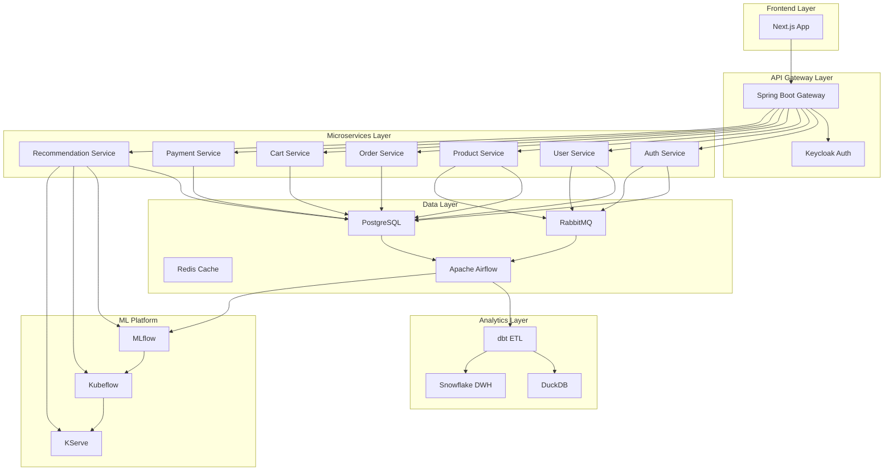

# ECShop - Enterprise E-commerce Platform

## 概要
ECShopは、最新のクラウドネイティブ技術スタックを活用したエンタープライズグレードのECプラットフォームです。マイクロサービスアーキテクチャ、データドリブンなレコメンデーション、MLOpsによる継続的な機械学習改善を特徴としています。

## 技術スタック

### アプリケーション層
- **フロントエンド**: Next.js (TypeScript)
- **API Gateway**: Spring Boot
- **マイクロサービス**: Gin (Go)
- **認証基盤**: Keycloak

### データプラットフォーム
- **メインDB**: PostgreSQL
- **メッセージキュー**: RabbitMQ
- **キャッシュ**: Redis
- **ワークフロー**: Apache Airflow
- **ETL**: dbt
- **分析DB**: DuckDB
- **データウェアハウス**: Snowflake

### MLOpsプラットフォーム
- **実験管理**: MLflow
- **パイプライン**: Kubeflow
- **モデル配信**: KServe
- **オーケストレーション**: Apache Airflow

### インフラ
- **開発環境**: WSL (Docker Compose)
- **本番環境**: AWS EKS
- **構成管理**: Terraform

## システム構成



## マイクロサービス設計

### 🔐 Auth Service
**責務**: JWT発行・検証、Keycloak連携、セッション管理

```go
// APIs:
POST   /api/v1/auth/login
POST   /api/v1/auth/logout  
POST   /api/v1/auth/refresh
GET    /api/v1/auth/verify
POST   /api/v1/auth/password-reset
POST   /api/v1/auth/mfa/enable

// Internal APIs:
GET    /api/internal/auth/validate-token
GET    /api/internal/auth/user-permissions/{userId}
```

### 👤 User Service
**責務**: ユーザープロファイル管理、設定・嗜好、Keycloak同期

```go
// APIs:
GET    /api/v1/users/{id}
PUT    /api/v1/users/{id}
GET    /api/v1/users/{id}/profile
PUT    /api/v1/users/{id}/preferences
GET    /api/v1/users/{id}/analytics

// Admin APIs:
GET    /api/v1/admin/users
POST   /api/v1/admin/users/{id}/roles
```

### 🛍️ Product Service
**責務**: 商品マスタ管理、カテゴリ管理、在庫管理

```go
// APIs:
GET    /api/v1/products
GET    /api/v1/products/{id}
POST   /api/v1/products
PUT    /api/v1/products/{id}
GET    /api/v1/categories
```

### 📦 Order Service
**責務**: 注文処理、決済連携、注文履歴管理

```go
// APIs:
POST   /api/v1/orders
GET    /api/v1/orders/{id}
GET    /api/v1/users/{userId}/orders
PUT    /api/v1/orders/{id}/status
```

### 🛒 Cart Service
**責務**: カート管理、セッション管理、一時保存

```go
// APIs:
GET    /api/v1/users/{userId}/cart
POST   /api/v1/users/{userId}/cart/items
PUT    /api/v1/users/{userId}/cart/items/{itemId}
DELETE /api/v1/users/{userId}/cart/items/{itemId}
```

### 💳 Payment Service
**責務**: 決済処理、PCI DSS準拠、不正検知

```go
// APIs:
POST   /api/v1/payments
GET    /api/v1/payments/{id}
POST   /api/v1/payments/{id}/refund
GET    /api/v1/users/{userId}/payment-methods
POST   /api/v1/users/{userId}/payment-methods
```

### 🎯 Recommendation Service
**責務**: MLモデル予測、レコメンデーション生成、A/Bテスト

```go
// APIs:
GET    /api/v1/users/{userId}/recommendations
POST   /api/v1/recommendations/feedback
GET    /api/v1/products/{productId}/similar
```

### ⚙️ Workflow Orchestration Service
**責務**: データパイプライン管理、MLワークフロー自動化

```go
// APIs:
POST   /api/v1/workflows/trigger/{workflow_id}
GET    /api/v1/workflows/status/{execution_id}
POST   /api/v1/workflows/retry/{execution_id}
```

## データモデル設計

### Core Entities

```prisma
model User {
  id              String    @id @default(uuid())
  email           String    @unique
  keycloakId      String    @unique
  firstName       String?
  lastName        String?
  emailVerified   Boolean   @default(false)
  lastLoginAt     DateTime?
  status          UserStatus @default(ACTIVE)
  createdAt       DateTime  @default(now())
  updatedAt       DateTime  @updatedAt
  
  userRoles       UserRole[]
  viewHistories   ViewHistory[]
  cartItems       CartItem[]
  orders          Order[]
  
  @@index([keycloakId])
  @@index([email])
}

model Product {
  id              String    @id @default(uuid())
  name            String
  description     String?
  price           Decimal   @db.Money
  stockQuantity   Int
  status          ProductStatus @default(ACTIVE)
  createdAt       DateTime  @default(now())
  updatedAt       DateTime  @updatedAt
  
  categories      ProductCategory[]
  orderItems      OrderItem[]
  cartItems       CartItem[]
  viewHistories   ViewHistory[]
  
  @@index([status])
  @@index([createdAt])
}

model Order {
  id              String    @id @default(uuid())
  userId          String
  totalAmount     Decimal   @db.Money
  status          OrderStatus @default(PENDING)
  paymentId       String?
  orderedAt       DateTime  @default(now())
  
  user            User      @relation(fields: [userId], references: [id])
  items           OrderItem[]
  returns         Return[]
  
  @@index([userId])
  @@index([status])
  @@index([orderedAt])
}

// Payment Service専用データベース
model Payment {
  id                String        @id @default(uuid())
  orderId           String
  userId            String
  amount            Decimal       @db.Money
  currency          String        @default("JPY")
  status            PaymentStatus @default(PENDING)
  paymentMethod     PaymentMethod
  
  // セキュリティ & コンプライアンス
  ipAddress         String?
  userAgent         String?
  riskScore         Float?
  
  createdAt         DateTime      @default(now())
  updatedAt         DateTime      @updatedAt
  processedAt       DateTime?
  
  refunds           Refund[]
  disputes          Dispute[]
  
  @@index([orderId])
  @@index([userId])
  @@index([status])
}
```

## Keycloak認証・認可設計

### Realm設定

```json
{
  "realm": "ecshop",
  "enabled": true,
  "displayName": "ECShop Platform",
  "userManagedAccessAllowed": true
}
```

### ロール設計

```yaml
Realm Roles:
  # 顧客ロール
  - customer: "一般顧客"
  - premium_customer: "プレミアム顧客"
  
  # スタッフロール
  - staff: "スタッフ基本権限"
  - inventory_manager: "在庫管理者"
  - sales_manager: "営業管理者"
  
  # 管理者ロール
  - admin: "プラットフォーム管理者"
  - super_admin: "スーパー管理者"

Client Roles (ecshop-services):
  # サービス別権限
  - user:read, user:write, user:admin
  - product:read, product:write, product:admin
  - order:read, order:write, order:process, order:admin
  - cart:read, cart:write
  - recommendation:read, recommendation:admin
```

## Apache Airflow ワークフロー

### データパイプライン DAG

```python
# dags/data_pipeline/daily_etl.py
dag = DAG(
    'daily_etl_pipeline',
    description='Daily ETL from PostgreSQL to Snowflake',
    schedule_interval='0 2 * * *',  # 毎日 AM 2:00
    start_date=datetime(2025, 1, 1),
    catchup=False
)

# 1. データ品質チェック
data_quality_check = PostgresOperator(
    task_id='data_quality_check',
    sql="SELECT COUNT(*) FROM orders WHERE DATE(ordered_at) = CURRENT_DATE - INTERVAL '1 day'",
    dag=dag
)

# 2. dbt変換
dbt_run = KubernetesPodOperator(
    task_id='dbt_transform',
    image='your-repo/dbt-snowflake:latest',
    cmds=['dbt', 'run', '--select', 'tag:daily'],
    namespace='ecshop-data',
    dag=dag
)

# 3. Snowflakeデータ同期
sync_to_snowflake = SnowflakeOperator(
    task_id='sync_to_snowflake',
    sql="CALL sync_daily_data_procedure('{{ ds }}');",
    dag=dag
)

data_quality_check >> dbt_run >> sync_to_snowflake
```

### MLパイプライン DAG

```python
# dags/ml_pipeline/recommendation_training.py
dag = DAG(
    'recommendation_model_training',
    description='Weekly recommendation model retraining',
    schedule_interval='0 1 * * 0',  # 毎週日曜 AM 1:00
    start_date=datetime(2025, 1, 1),
    catchup=False
)

# 1. 特徴量準備
prepare_features = KubernetesPodOperator(
    task_id='prepare_features',
    image='your-repo/ml-feature-engineering:latest',
    cmds=['python', 'prepare_features.py'],
    namespace='ecshop-ml',
    dag=dag
)

# 2. モデル訓練
train_model = KubernetesPodOperator(
    task_id='train_recommendation_model',
    image='your-repo/kubeflow-client:latest',
    cmds=['python', 'trigger_training_pipeline.py'],
    namespace='ecshop-ml',
    dag=dag
)

# 3. モデル評価とデプロイ
evaluate_and_deploy = KubernetesPodOperator(
    task_id='evaluate_and_deploy',
    image='your-repo/ml-deployment:latest',
    cmds=['python', 'evaluate_and_deploy.py'],
    namespace='ecshop-ml',
    dag=dag
)

prepare_features >> train_model >> evaluate_and_deploy
```

## MLモデル設計

### レコメンデーションアルゴリズム

```python
# 1. Random Forest - 商品レコメンデーション
features = [
    'user_view_frequency',
    'product_category',
    'product_rating',
    'product_price_range',
    'time_since_last_view'
]

# 2. K-means - ユーザーセグメンテーション  
features = [
    'avg_cart_value',
    'cart_frequency', 
    'preferred_categories',
    'price_sensitivity'
]

# 3. Linear Regression - 売上予測
features = [
    'seasonal_trends',
    'user_lifetime_value',
    'product_popularity',
    'promotional_impact'
]
```

## セキュリティ設計

### 認証・認可
- **認証**: Keycloak OIDC/OAuth2、JWT、MFA対応
- **認可**: RBAC、細粒度権限、API Gateway認可
- **Service間通信**: mTLS

### データセキュリティ
```yaml
暗号化:
  - TLS 1.3 全通信
  - PostgreSQL暗号化
  - S3バケット暗号化
  - Secrets Manager

PCI DSS準拠:
  - Payment Service分離
  - カードデータ暗号化
  - リアルタイム不正検知
  - 詳細監査ログ
```

## インフラ構成

### Kubernetes Namespaces
```yaml
Namespaces:
  - ecshop-frontend: Next.js (3 replicas)
  - ecshop-api: Spring Gateway (2 replicas)  
  - ecshop-services: Gin microservices (2 replicas each)
  - ecshop-data: PostgreSQL, Redis, RabbitMQ
  - ecshop-ml: MLflow, Kubeflow components
  - ecshop-airflow: Scheduler, Webserver, Workers
  - ecshop-auth: Keycloak (2 replicas)
  - ecshop-payment: Payment Service (3 replicas)
```

### AWS Resources
```hcl
# Terraform管理
- EKS Cluster (Multi-AZ)
- RDS PostgreSQL (Multi-AZ) x4 (Main, Keycloak, Payment, Airflow)
- ElastiCache Redis
- S3 (data lake, artifacts, logs)
- ALB (ingress)
- Route53 (DNS)
- CloudWatch (monitoring)
- Secrets Manager
- WAF (Payment保護)
```

## パフォーマンス要件

### SLA/SLO
```yaml
API応答時間:
  - p95 < 200ms (商品カタログ)
  - p95 < 500ms (レコメンデーション)
  - p95 < 100ms (カート操作)
  - p95 < 300ms (決済処理)

可用性:
  - 99.9% 稼働率
  - 99.99% 決済サービス

MLパフォーマンス:
  - レコメンデーション関連性 > 85%
  - モデル訓練 < 2時間
  - リアルタイム推論 < 50ms

決済パフォーマンス:
  - 決済成功率 > 99%
  - 不正検知精度 > 95%
```

## 開発・運用

### 開発環境セットアップ
```bash
# リポジトリクローン
git clone https://github.com/your-org/ecshop
cd ecshop

# インフラ構築
cd terraform && terraform apply

# Keycloak設定
cd scripts && ./setup-keycloak.sh

# ローカル開発
docker-compose up -d
npm run dev
```

### 本番デプロイ
```bash
# ArgoCD経由デプロイ
kubectl apply -f k8s/argocd-apps/

# サービスアクセス
kubectl port-forward -n ecshop-airflow svc/airflow-webserver 8080:8080
kubectl port-forward -n ecshop-auth svc/keycloak 8081:8080
```

### モニタリング
```yaml
Observability:
  - Metrics: Prometheus + Grafana
  - Logging: ELK Stack
  - Tracing: Jaeger
  - Alerting: AlertManager + PagerDuty

ビジネスメトリクス:
  - コンバージョン率
  - カート放棄率
  - レコメンデーションCTR
  - モデルパフォーマンス
  - データパイプラインSLA
```

## 今後の拡張

### Phase 1 (現在)
- 基本EC機能
- 基本レコメンデーション
- 基盤構築

### Phase 2 (3-6ヶ月)
- 高度なMLモデル
- リアルタイムパーソナライゼーション
- モバイルアプリ

### Phase 3 (6-12ヶ月)
- マルチテナント対応
- 高度な分析機能
- 国際展開

---

**License**: MIT  
**Maintainer**: Data Engineering Team  
**Last Updated**: 2025-06-30
